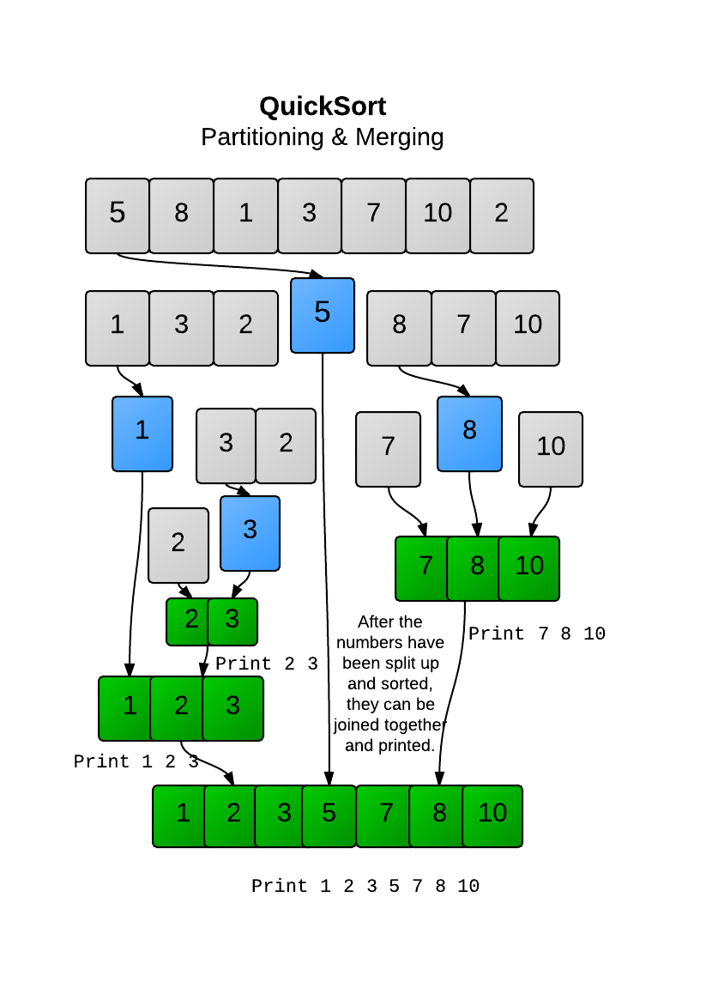

## How to solve this challenge?

1. Read the "Challenge description" below.
2. Make changes to the [challenge.rb](./challenge.rb) file.
3. Commit your changes.
4. Wait for the result of the "GitHub Classroom Workflow" action. If it is green - congratulations, you solved this challenge! If not - try again!
      - If you cannot see any auto-grading workflows on the  [Actions](../../actions) page, learn how to fix it in [this repo](https://github.com/microverse-students/autograding-troubles-ruby).
5. *You can watch an example of how to solve a challenge in the video in the theory lesson you already completed.*

Note: We use RSpec for checking your solution with unit tests. You can [install](https://github.com/rspec/rspec) it and use it in your local environment if you like.


## Challenge description

### Simple Quick Sort

In the previous challenge, you wrote a 'partition' method to split an array into smaller and greater elements. This means you 'sorted' half the array with respect to the other half. Can you repeatedly use 'partition' to sort an entire array?

#### Guideline
In Insertion sort, you simply went through each element in order and inserted it into a sorted sub-array. In this challenge, you cannot focus on one element at a time, but instead must deal with whole sub-arrays. Each time you call partition, you are sorting two parts of the array with respect to each other. Notice if you called partition on two elements, that sub-array would be fully sorted. 

Can you repeatedly call partition on each sub-array so that the entire array ends up sorted?

In this challenge, print your array every time you finish your partitioning method, i.e. when you combine the partitioned array together. The first element in a sub-array should be used as a pivot. Partition the left side before partitioning the right side. Do not add the pivot to either side. Instead, put it in the middle when combining the two lists together.



#### Challenge

Can you code a Quicksort algorithm?

#### Example
```
p simple_quicksort([5, 8, 1, 3, 7, 10, 2])
# => 2 3
#    1 2 3
#    7 8 10
#    1 2 3 5 7 8 10
```

### Troubleshooting

If you cannot see any auto-grading workflows on the [Actions](../../actions) page, learn how to fix it in [this repo](https://github.com/microverse-students/autograding-troubles-ruby).
